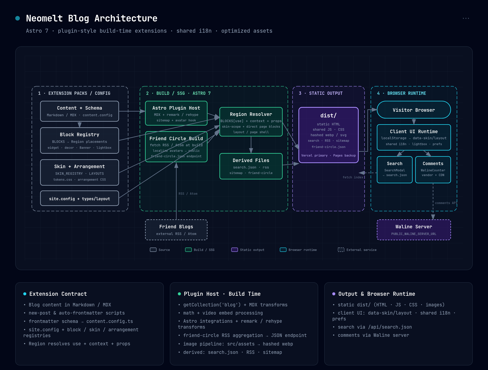

# Neomelt Blog

基于 Astro 的个人博客项目。

日常操作看 [docs/operations.md](docs/operations.md)，变更记录看 [CHANGELOG.md](CHANGELOG.md)，仓库外的配置变更（Vercel / DNS 等）记在 [docs/ops-log.md](docs/ops-log.md)。

## 架构图



图源是 `docs/architecture/diagram.html`——一个自包含的深色架构图（内联 SVG、手工排版、坐标固定），按 [Cocoon 架构图 skill](https://github.com/Cocoon-AI/architecture-diagram-generator) 的风格绘制。当前图对应 v2.1 的 registry-driven 架构：`site.config.ts` 装配 block，`skins/` 与 `arrangements/` 分别提供视觉 token 和列表规则，i18n 字典以共享 hash module 下发，正文图片统一走 `src/assets` 的 Astro 图片管线。改完图后重新生成 `.png`：用浏览器打开该 HTML，点右上角 `⋯` → `🖼️ PNG` 导出即可，无需额外工具。

## 目录结构

```text
.
├── docs/
│   ├── architecture/        # 架构图：.html 源（自带导出）+ .png
│   ├── operations.md        # 操作指南：发文、换封面、改外观、加组件
│   └── ops-log.md           # 运维日志：仓库外的配置变更（Vercel / DNS 等）
├── public/                  # 直接静态资源（按 URL 原样输出，不经过构建管线）
│   ├── avatars/             # 构建时下载并本地化的友链头像
│   ├── fonts/
│   ├── music/               # 播放器音频
│   └── vendor/              # 第三方脚本（如 Waline）
├── scripts/                 # 发布与内容维护脚本
├── src/
│   ├── arrangements/        # 文章列表的 5 种排版，各一个 css + 一份登记表
│   ├── assets/              # 走 Astro 图片管线的资源
│   │   ├── banner/          # 首屏背景图
│   │   ├── blog/<slug>/     # 文章正文配图
│   │   └── covers/          # 文章封面池
│   ├── blocks/              # 组件库，按接口形状分目录，见 docs/operations.md
│   │   ├── behavior/        # 脚本/行为，无独立可见 UI，挂一次全局生效
│   │   ├── chrome/          # Header / Footer / 阅读设置面板
│   │   ├── decor/           # 背景、进度条、返回顶部
│   │   ├── surface/         # 带 slot 的容器
│   │   ├── view/            # 需要页面喂数据的展示组件
│   │   ├── widget/          # 侧栏挂件，自己查数据
│   │   └── registry.ts      # 能被区域放置的 block 登记表
│   ├── components/          # 不属于 block 体系的：BaseHead、SearchModal、Region
│   ├── content/
│   │   └── blog/            # 博客 Markdown/MDX
│   ├── data/                # 站点数据（友链、播放列表、阅读设置项）
│   ├── i18n/
│   ├── layouts/             # 页面骨架（BaseLayout / BlogPost / PolicyPage）
│   ├── pages/
│   │   ├── api/             # search.json 等端点
│   │   ├── posts/           # 列表 / 归档 / 分页 / 详情
│   │   └── terms/           # 隐私、版权、免责声明等
│   ├── skins/               # 两套皮肤的 token，各一个 tokens.css + 一份登记表
│   ├── styles/              # global.css，只消费 token 不定义 token
│   ├── types/
│   ├── utils/
│   ├── consts.ts
│   ├── content.config.ts
│   ├── env.d.ts             # inline script 挂在 window 上的全局声明
│   └── site.config.ts       # 装配文件：站点由哪些 block 组成、默认皮肤与排版
├── astro.config.mjs
├── CHANGELOG.md             # 可感知的变化与架构调整
└── package.json
```

这里的“插件式”指构建期的 registry + slots 装配，不是运行时安装 npm 插件：`Region` 按
`BlockName` 从 `BLOCKS` 解析组件，`site.config.ts` 的 regions 保存 placement（名称、props、
skins）。三层的分工是：`blocks/` 只有功能实现，`skins/` 只有取值，`arrangements/` 只有排版规则；
`site.config.ts` 负责装配。加皮肤或加排版都是两步（写文件 + 登记一行），细节见
[docs/operations.md](docs/operations.md)。

构建时，Astro 从 `src/content/blog/` 读取 Markdown/MDX，生成文章页、归档、标签、系列、RSS、站点地图和搜索索引；友链 RSS 在构建时整理为 `/friend-circle.json`，头像下载到 `public/avatars/`。正文插图和封面留在 `src/assets/`，由 Astro 处理成带 hash 的 webp；`public/` 只放必须按原 URL 输出的字体、音频、头像和第三方脚本。浏览器端只负责主题、语言、阅读设置、搜索和评论等交互。

## 内容维护约定

- 新文章放在 `src/content/blog/`。
- 文章 frontmatter 默认 `heroImage` 使用 `src/assets/cover.svg`。
- 可以通过 frontmatter 的 `hidden: true` 暂时隐藏文章（不会出现在列表、归档、标签、RSS、搜索，也不会生成公开详情页）。
- 文章插图放在 `src/assets/blog/<文章-slug>/`，封面放 `src/assets/covers/`，首屏背景放 `src/assets/banner/`。在 Markdown 用相对路径引用，如 ``。放这里才会过 Astro 的图片管线（转 webp、加 hash）；放 `public/` 会原样输出，等于多发一份没人引用的原图。
- 需要固定公网 URL、且不该被改写的资源（字体、音频、第三方脚本）才放 `public/`。

## 常用命令

**需要 Node 22**（Astro 7 在 Node 20 上直接拒绝启动）。仓库里有 `.nvmrc`，进目录 `nvm use` 即可。

- `npm run dev`：本地开发
- `npm run build`：生产构建
- `npm run preview`：本地预览构建产物
- `npm run test`：运行测试（含皮肤与排版的契约检查）
- `npx astro check`：类型检查，应为 0 error
- `npm run new`：创建新文章模板
- `npm run covers`：抓取新的封面候选图
- `npm run covers:lock`：给还没有封面的文章各分配一张
- `npm run watch:frontmatter`：自动补齐 frontmatter

## 自动生成文章头（frontmatter）

现在有两种方式：

- `npm run new` / `npm run new:post`：创建新文章并自动写入完整 frontmatter
- `npm run watch:frontmatter`：监听 `src/content/blog/`，给“缺失 frontmatter 的 md/mdx”自动补齐

### 方式 1：新建文章时自动生成

交互式创建（推荐）：

```bash
npm run new
```

命令行参数创建：

```bash
npm run new -- --title "我的新文章" --tags "astro,blog" --category "开发" --series "折腾记录"
```

常用参数：

- `--title` 文章标题（必填）
- `--slug` 文件名（默认由标题自动生成）
- `--desc` 描述
- `--tags` 逗号分隔标签
- `--category` 分类
- `--series` 系列
- `--pinned` 是否置顶（`true/false`）
- `--hidden` 是否隐藏（`true/false`）
- `--hero` 头图路径（默认 `../../assets/cover.svg`）
- `--pubDate` 发布时间（默认当前时间）
- `--dry-run` 只预览，不落盘

### 方式 2：已有文章自动补齐 frontmatter

```bash
npm run watch:frontmatter
```

说明：

- 启动后会先扫描一次 `src/content/blog/`
- 之后监听文件变化，发现没有 frontmatter 的 `.md/.mdx` 会自动补齐
- 已经有 frontmatter 的文件不会被覆盖

## 视频快捷插入

在博客 Markdown 中支持以下写法，最终渲染为响应式 iframe：

```md
@[video](https://www.youtube.com/watch?v=M7lc1UVf-VE)
@[youtube](M7lc1UVf-VE)
@[bilibili](https://www.bilibili.com/video/BV1xx411c7mD)
```

## 致谢

本项目的架构图采用 [Cocoon AI](https://github.com/Cocoon-AI) 开源的 [Architecture Diagram Skill](https://github.com/Cocoon-AI/architecture-diagram-generator) 绘制——其深色主题设计系统与内联 SVG 模板（MIT License，Copyright © 2025 Cocoon AI）为本图的样式与排版提供了基础。在此向原作者表示诚挚的谢意。
