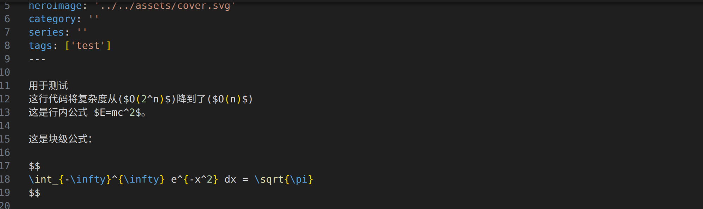

用于测试
这行代码将复杂度从($O(2^n)$)降到了($O(n)$)
这是行内公式 $E=mc^2$。

这是块级公式：

$$
\int_{-\infty}^{\infty} e^{-x^2} dx = \sqrt{\pi}
$$ 

  
图片的快捷插入采用markdown-image插件来实现，需要按下shift+alt+v实现将剪切板的图片插入markdown中，并自动创建文件夹和相对路径链接